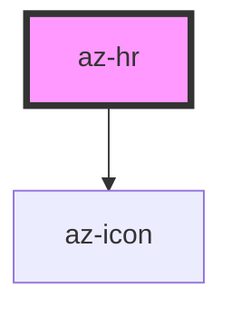

# az-hr

<!-- Auto Generated Below -->

## Properties

| Property          | Attribute          | Description | Type                            | Default     |
| ----------------- | ------------------ | ----------- | ------------------------------- | ----------- |
| `caption`         | `caption`          |             | `string`                        | `undefined` |
| `captionPosition` | `caption-position` |             | `"center" \| "left" \| "right"` | `'left'`    |
| `icon`            | `icon`             |             | `string`                        | `undefined` |
| `iconPosition`    | `icon-position`    |             | `"center" \| "left" \| "right"` | `'left'`    |

## Dependencies

### Depends on

- [az-icon](../icons)

### Graph

----------------------------------------------

*Built with [StencilJS](https://stenciljs.com/)*
