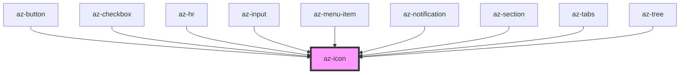

# az-icon

<!-- Auto Generated Below -->

## Properties

| Property      | Attribute      | Description | Type                       | Default                     |
| ------------- | -------------- | ----------- | -------------------------- | --------------------------- |
| `caption`     | `caption`      |             | `string`                   | `''`                        |
| `color`       | `color`        |             | `string`                   | `'var(--az-caption-color)'` |
| `height`      | `height`       |             | `number \| string`         | `12`                        |
| `hoverEffect` | `hover-effect` |             | `string`                   | `undefined`                 |
| `icon`        | `icon`         |             | `string`                   | `''`                        |
| `register`    | `register`     |             | `boolean`                  | `false`                     |
| `svgAttr`     | --             |             | `{ [x: string]: string; }` | `{}`                        |
| `tag`         | `tag`          |             | `string`                   | `''`                        |
| `wait`        | `wait`         |             | `boolean`                  | `false`                     |
| `width`       | `width`        |             | `number \| string`         | `12`                        |

## Dependencies

### Used by

 - [az-button](../button)
 - [az-checkbox](../checkbox)
 - [az-hr](../hr)
 - [az-input](../input)
 - [az-menu-item](../menu-item)
 - [az-notification](../notification)
 - [az-section](../section)
 - [az-tabs](../tabs)
 - [az-tree](../tree)

### Graph

----------------------------------------------

*Built with [StencilJS](https://stenciljs.com/)*
