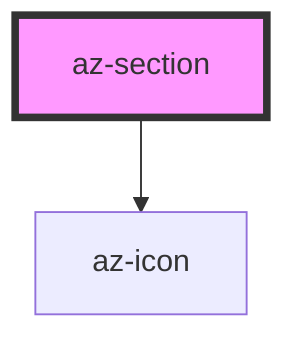

# az-section

<!-- Auto Generated Below -->

## Properties

| Property          | Attribute          | Description | Type                            | Default        |
| ----------------- | ------------------ | ----------- | ------------------------------- | -------------- |
| `arrowPosition`   | `arrow-position`   |             | `"left" \| "right"`             | `'left'`       |
| `caption`         | `caption`          |             | `string`                        | `''`           |
| `captionPosition` | `caption-position` |             | `"center" \| "left" \| "right"` | `'left'`       |
| `collapsable`     | `collapsable`      |             | `boolean`                       | `true`         |
| `collapsed`       | `collapsed`        |             | `boolean`                       | `false`        |
| `icon`            | `icon`             |             | `string`                        | `'arrow-down'` |
| `iconPosition`    | `icon-position`    |             | `"center" \| "left" \| "right"` | `'left'`       |

## Methods

### `collapse() => Promise<void>`

#### Returns

Type: `Promise<void>`

### `expand() => Promise<void>`

#### Returns

Type: `Promise<void>`

## Dependencies

### Depends on

- [az-icon](../icons)

### Graph

----------------------------------------------

*Built with [StencilJS](https://stenciljs.com/)*
