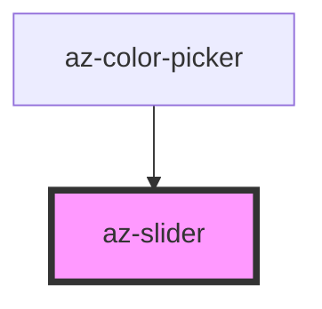

# az-slider

<!-- Auto Generated Below -->

## Properties

| Property  | Attribute | Description | Type               | Default     |
| --------- | --------- | ----------- | ------------------ | ----------- |
| `caption` | `caption` |             | `string`           | `''`        |
| `max`     | `max`     |             | `number \| string` | `undefined` |
| `min`     | `min`     |             | `number \| string` | `undefined` |
| `value`   | `value`   |             | `number \| string` | `undefined` |

## Dependencies

### Used by

 - [az-color-picker](../color-picker)

### Graph

----------------------------------------------

*Built with [StencilJS](https://stenciljs.com/)*
