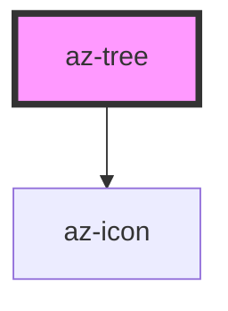

# az-tree

<!-- Auto Generated Below -->

## Properties

| Property                   | Attribute                      | Description | Type                            | Default                 |
| -------------------------- | ------------------------------ | ----------- | ------------------------------- | ----------------------- |
| `DndDataType`              | `dnd-data-type`                |             | `string`                        | `'application/json'`    |
| `activeItem`               | --                             |             | `AzTreeItem`                    | `null`                  |
| `activeOnMiddleButtonDown` | `active-on-middle-button-down` |             | `boolean`                       | `true`                  |
| `caption`                  | `caption`                      |             | `string`                        | `''`                    |
| `checkedItems`             | --                             |             | `Set<AzTreeItem>`               | `new Set<AzTreeItem>()` |
| `icon`                     | `icon`                         |             | `string`                        | `undefined`             |
| `iconPosition`             | `icon-position`                |             | `"center" \| "left" \| "right"` | `'left'`                |
| `itemDraggable`            | `item-draggable`               |             | `boolean`                       | `false`                 |
| `items`                    | --                             |             | `AzTreeItem[]`                  | `[]`                    |
| `selecting`                | `selecting`                    |             | `boolean`                       | `false`                 |

## Events

| Event          | Description | Type               |
| -------------- | ----------- | ------------------ |
| `collapsed`    |             | `CustomEvent<any>` |
| `expanded`     |             | `CustomEvent<any>` |
| `inserted`     |             | `CustomEvent<any>` |
| `itemdragover` |             | `CustomEvent<any>` |
| `itemdrop`     |             | `CustomEvent<any>` |
| `itemremoved`  |             | `CustomEvent<any>` |
| `itemremoving` |             | `CustomEvent<any>` |
| `selected`     |             | `CustomEvent<any>` |

## Methods

### `addItem(itemOrCaption: AzTreeItem | string, parent?: AzTreeItem | number, attrs?: any) => Promise<AzTreeItem>`

#### Returns

Type: `Promise<AzTreeItem>`

### `clearActiveItem() => Promise<void>`

#### Returns

Type: `Promise<void>`

### `collapsAll() => Promise<void>`

#### Returns

Type: `Promise<void>`

### `expandAll(level: number) => Promise<void>`

#### Returns

Type: `Promise<void>`

### `find(predicate: TreeItemVisitor) => Promise<any>`

#### Returns

Type: `Promise<any>`

### `findAll(predicate: TreeItemVisitor) => Promise<any[]>`

#### Returns

Type: `Promise<any[]>`

### `fromJson(items: IAzTreeItem[]) => Promise<void>`

#### Returns

Type: `Promise<void>`

### `removeItem(indexOrItem: number | AzTreeItem) => Promise<void>`

#### Returns

Type: `Promise<void>`

### `setActiveItem(item: AzTreeItem, clear?: boolean) => Promise<void>`

#### Returns

Type: `Promise<void>`

### `toJson(opts?: SerializeOptions) => Promise<(string | Record<keyof IAzTreeItem, any>)[]>`

#### Returns

Type: `Promise<(string | Record<keyof IAzTreeItem, any>)[]>`

### `traverse(visit: TreeItemVisitor) => Promise<void>`

#### Returns

Type: `Promise<void>`

## Dependencies

### Depends on

- [az-icon](../icons)

### Graph

----------------------------------------------

*Built with [StencilJS](https://stenciljs.com/)*
